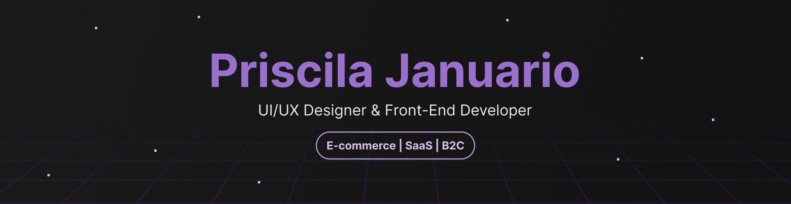

  

 

<table border="0" cellspacing="0" cellpadding="20">
<tr>
<td width="100%" valign="top">

### About Me

UI Designer and Front-End Developer building digital interfaces for web and mobile products. I've worked with teams across the US and LATAM to turn ideas into clean, accessible user experiences. Combining visual UI design with front-end engineering, I ensure that interfaces are not only visually engaging but technically easy to implement.

### Tech Stack

  
  
  
  
  

### Creative Lab
While my core expertise is high-converting websites, I use my GitHub to experiment with bold, retro aesthetics and games. This space serves as the horizontal creative stretch of my professional skill set.

> **Current Focus:** Actively experimenting with new things in front-end development to sharpen my web design skills and push my craft further.

</td>
</tr>
</table>

### :love_letter: Let's Connect

  

